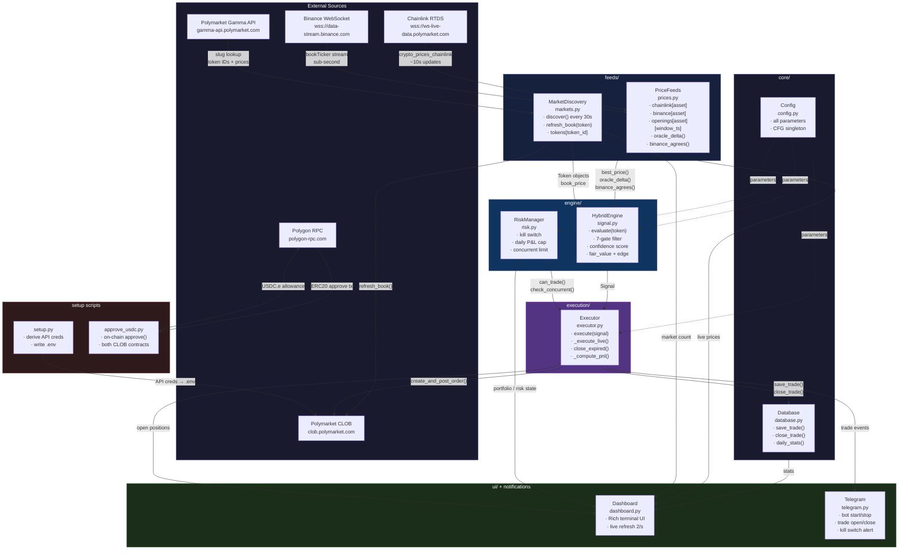

# Oracle-Confirmed Sniper (Strategy D)

A Polymarket trading bot that combines **oracle-lead detection** with **end-cycle sniping** on BTC and ETH 5-minute prediction markets.

## Architecture



## How It Works

The bot exploits a structural edge: Chainlink oracle prices resolve Polymarket's 5-minute crypto markets, but the oracle answer is publicly readable seconds before resolution. When the oracle has moved significantly from the window's opening price, the outcome is largely determined — yet tokens may still be priced below $1.00.

**Two-phase strategy:**

| Phase | Window | Action |
|---|---|---|
| 1 — Oracle watch | T-120s to T-60s | Monitor Chainlink delta vs. opening price; build conviction |
| 2 — Snipe execution | T-60s to T-3s | If oracle confirms AND token is in range → execute |

**All conditions must be true to trade:**
1. Time remaining is within the snipe window (T-60s to T-3s, tiered by delta strength)
2. Chainlink oracle has moved at least `min_delta_pct` from the window's opening price
3. Token price is in the range $0.55–$0.95 (market partially agrees, room for profit)
4. Combined confidence score exceeds threshold

## Confidence Scoring

Scores combine four components (max 100):

| Component | Max | Description |
|---|---|---|
| Delta score | 40 | How far oracle moved from window open |
| Time score | 30 | Less time remaining = outcome more certain |
| Price score | 20 | Higher token price = stronger market agreement |
| Freshness score | 10 | Chainlink data staleness |

## Project Structure

```
oracle-confirmed-sniper/
├── bot.py              # Main entry point and event loop
├── analyze.py          # Shim: python3 analyze.py <args> (calls analysis/analyze.py)
├── setup.py            # Generates API credentials from wallet key → writes .env
├── approve_usdc.py     # On-chain USDC.e approve() for both CLOB spender contracts
├── setup_gcp.sh        # One-shot GCP server setup script
├── requirements.txt
├── .env.example
├── pre_setup.env       # Fill with private key + funder address before running setup.py
├── core/
│   ├── config.py       # All tunable parameters (CFG)
│   ├── models.py       # Data classes: Token, OracleState, Signal, Trade
│   ├── database.py     # SQLite persistence
│   └── telegram.py     # Telegram notifications
├── feeds/
│   ├── prices.py       # Price feeds: Chainlink (RTDS) + Binance WebSocket
│   └── markets.py      # Market discovery via Gamma API
├── engine/
│   ├── signal.py       # HybridEngine: signal evaluation and sizing
│   └── risk.py         # RiskManager: kill switches, daily caps
├── execution/
│   └── executor.py     # Trade execution (paper and live)
├── ui/
│   └── dashboard.py    # Rich terminal UI
└── analysis/
    └── analyze.py      # Trade analysis with --watch mode
```

## Setup

**Requirements:** Python 3.12+

```bash
pip install -r requirements.txt
```

### Step 1 — Polymarket API Credentials

Fill in `pre_setup.env` with your wallet details:

```env
POLY_PRIVATE_KEY=0x...
POLY_FUNDER_ADDRESS=0x...
```

Then run:

```bash
python3 setup.py
```

This connects to Polymarket's CLOB using your private key, derives API key/secret/passphrase, and writes everything to `.env` automatically. Also attempts to set the USDC.e allowance via API.

> Re-running `setup.py` is safe — it derives the same credentials from the same key.

### Step 2 — On-Chain USDC.e Approval

The API-based allowance sometimes doesn't register on-chain. Run this to submit the real `approve()` transaction directly to Polygon for both CLOB spender contracts:

```bash
python3 approve_usdc.py
```

Expected output:
```
✅ CTF Exchange:          approved (max)
✅ NegRisk CTF Exchange:  approved (max)
```

This only needs to be done once per wallet — the approval is permanent on-chain.

> If you get `Could not connect to Polygon RPC`, the script automatically tries 5 different public RPC endpoints. Check your network if all fail.

### Step 3 — Telegram Alerts (optional)

Add to `.env`:

```env
TELEGRAM_BOT_TOKEN=your_bot_token
TELEGRAM_CHAT_ID=your_chat_id
```

The bot will send alerts for: bot start/stop, every trade opened, every trade closed (win/loss), kill switch activation.

To get credentials: message `@BotFather` → `/newbot` for the token; message `@userinfobot` for your chat ID.

## Usage

### Paper mode (default — no real money)

```bash
python3 bot.py
python3 bot.py --portfolio 500   # custom starting portfolio size
```

### Live mode

Live mode requires three explicit flags as a safety gate:

```bash
python3 bot.py --live --confirm-live --accept-risk
```

### Analyze past trades

```bash
python3 analyze.py                          # all history, one-shot
python3 analyze.py --days 7                 # last 7 days, one-shot

# Auto-refresh (built-in watch mode)
python3 analyze.py --watch                  # refresh every 60s
python3 analyze.py --watch --interval 30    # refresh every 30s
python3 analyze.py --watch --interval 60 --days 7
```

The watch mode clears the terminal on each cycle and shows a live countdown to the next refresh. Press `Ctrl+C` to exit.

## GCP Deployment

The included `setup_gcp.sh` automates server setup on a GCP instance.

### 1. Create the instance (from your local machine)

```bash
gcloud compute instances create polymarket-bot \
  --zone=europe-southwest1-a \
  --machine-type=e2-small \
  --network-tier=PREMIUM \
  --image-family=ubuntu-2404-lts-amd64 \
  --image-project=ubuntu-os-cloud \
  --boot-disk-size=20GB \
  --boot-disk-type=pd-balanced
```

> **Important:** Do NOT use `europe-west2` (London) — UK is geoblocked by Polymarket. `europe-southwest1` (Madrid) is used instead. Run all bot commands from the GCP server — Polymarket is also geoblocked in Indonesia.

### 2. SSH in and clone the repo

```bash
gcloud compute ssh polymarket-bot --zone=europe-southwest1-a
git clone https://github.com/andiyusanto/oracle-confirmed-sniper.git ~/oracle-confirmed-sniper
cd ~/oracle-confirmed-sniper
bash setup_gcp.sh
```

### 3. Configure credentials

```bash
nano pre_setup.env          # fill in POLY_PRIVATE_KEY and POLY_FUNDER_ADDRESS
python3 setup.py            # generates .env automatically
python3 approve_usdc.py     # approve USDC.e on-chain (required for live trading)
```

### 4. Test with paper mode, then go live

```bash
~/paper.sh           # paper mode with $1000 portfolio
~/start-bot.sh       # start live via systemd (auto-restarts on crash/reboot)
```

### Helper scripts (created by setup_gcp.sh)

| Script | Description |
|---|---|
| `~/start-bot.sh` | Start the bot as a systemd service |
| `~/stop-bot.sh` | Stop the bot |
| `~/logs.sh` | Tail `hybrid.log` |
| `~/analyze.sh [args]` | Run trade analysis (e.g. `~/analyze.sh --days 7`) |
| `~/paper.sh [portfolio]` | Run in paper mode (e.g. `~/paper.sh 500`) |

```bash
sudo systemctl status polymarket-bot   # check running status
```

### tmux Setup (recommended for manual runs)

tmux keeps the bot and analyzer running after you disconnect from SSH. `setup_gcp.sh` installs it automatically.

**First time — create the session:**

```bash
tmux new-session -d -s bot -n bot
tmux new-window -t bot -n analyze

# Window 1 (bot): run the bot
tmux send-keys -t bot:bot "cd ~/oracle-confirmed-sniper && source venv/bin/activate && python3 bot.py --live --confirm-live --accept-risk" Enter

# Window 2 (analyze): live analysis dashboard
tmux send-keys -t bot:analyze "cd ~/oracle-confirmed-sniper && source venv/bin/activate && python3 analyze.py --watch --interval 60 --days 7" Enter

# Attach to the session
tmux attach -t bot
```

**Navigating inside tmux:**

| Key | Action |
|---|---|
| `Ctrl+B, 0` | Switch to bot window |
| `Ctrl+B, 1` | Switch to analyze window |
| `Ctrl+B, d` | Detach (session keeps running) |
| `Ctrl+B, [` | Scroll mode (use arrow keys, `q` to exit) |

**Reconnect after SSH logout:**

```bash
tmux attach -t bot
```

**Other useful commands:**

```bash
tmux ls                        # list sessions
tmux kill-session -t bot       # stop everything
```

## Key Parameters (`core/config.py`)

### Timing
| Parameter | Default | Description |
|---|---|---|
| `snipe_entry_sec` | 60s | Max entry window for extreme delta (T-60s) |
| `snipe_entry_strong` | 45s | Max entry for strong delta (T-45s) |
| `snipe_entry_weak` | 25s | Max entry for weak delta (T-25s) |
| `snipe_exit_sec` | 3s | Stop entering at T-3s (fill time) |
| `oracle_watch_sec` | 120s | Start watching oracle from T-120s |

### Oracle thresholds
| Parameter | Default | Description |
|---|---|---|
| `min_delta_pct` | 0.015% | Minimum delta to consider (~$10 at $67k BTC) |
| `strong_delta_pct` | 0.05% | Strong signal threshold |
| `extreme_delta_pct` | 0.10% | Near-certain outcome threshold |

### Token price range
| Parameter | Default | Description |
|---|---|---|
| `min_token_price` | $0.55 | Don't buy below 55c (too risky) |
| `max_token_price` | $0.95 | Don't buy above 95c (no room for profit) |

### Position sizing
| Parameter | Default | Description |
|---|---|---|
| `max_position_pct` | 3% | Max position as % of portfolio |
| `max_position_usdc` | $30 | Hard cap per trade |
| `live_max_usdc` | $10 | Safety cap in live mode |

Size is scaled by entry price tier:
- **$0.55–0.70** → 0.5× (higher risk, lower reward)
- **$0.70–0.85** → 1.0× (standard)
- **$0.85–0.95** → 1.3× (high confidence)

Size is also scaled by edge magnitude:
- **edge ≥ 10%** → 1.2×
- **edge ≥ 5%** → 1.0×
- **edge ≥ 2%** → 0.85×
- **edge < 2%** → 0.7×

### Risk management
| Parameter | Default | Description |
|---|---|---|
| `kill_switch_drawdown_pct` | 15% | Hard stop for the day |
| `max_daily_loss_pct` | 10% | Pause after 10% daily loss |
| `max_daily_trades` | 100 | Cap for data collection |
| `max_concurrent_positions` | 4 | Max simultaneous open positions |

## Data

Trades are stored in `hybrid_trades.db` (SQLite). Logs are written to `hybrid.log`.

## Markets Supported

BTC and ETH 5-minute Polymarket prediction markets (configurable in `core/config.py` via `assets` and `durations`). 15-minute markets can be enabled by uncommenting the `durations` line in config.

## Risk Disclaimer

This bot trades real money in live mode. Prediction markets are inherently risky. Past paper performance does not guarantee live results. Use a dedicated wallet with only funds you can afford to lose.
