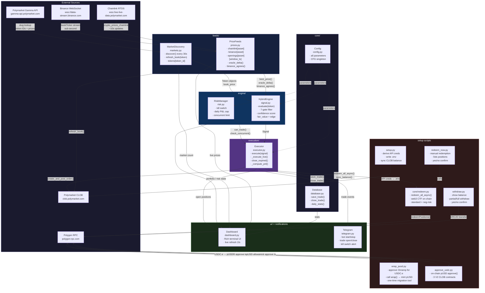

# Oracle-Confirmed Sniper (Strategy D)

A Polymarket trading bot that combines **oracle-lead detection** with **end-cycle sniping** on BTC, ETH and SOL 5-minute and 15-minute prediction markets.

## Architecture



## How It Works

The bot exploits a structural edge: Chainlink oracle prices resolve Polymarket's 5-minute crypto markets, but the oracle answer is publicly readable seconds before resolution. When the oracle has moved significantly from the window's opening price, the outcome is largely determined — yet tokens may still be priced below $1.00.

**Two-phase strategy:**

| Phase | Window | Action |
|---|---|---|
| 1 — Oracle watch | T-120s to T-75s | Monitor Chainlink delta vs. opening price; build conviction |
| 2 — Snipe execution | T-75s to T-16s | If oracle confirms AND token is in range → execute |

**All conditions must be true to trade:**
1. Current UTC hour is NOT in blackout set `{0, 2, 6, 7, 17}` — market-open volatility windows
2. Oracle direction is UP — DOWN signals are anti-predictive in bull conditions (WR=11.1%)
3. Time remaining is within the snipe window (tiered by delta strength: T-75s / T-55s / T-40s)
4. Chainlink oracle has moved at least `min_delta_pct` from the window's opening price
5. Binance agrees with Chainlink direction (dual-source confirmation)
6. Token YES price is in the range $0.55–$0.67 — above $0.67 the payoff math is negative-EV
7. Combined confidence score exceeds threshold AND computed edge ≥ 6%

**Why $0.67 is the structural ceiling:**

At each entry price, the payout ratio b = (1 − entry) / entry × (1 − fee). The breakeven win rate is 1/(1+b). With avg loss = full stake:

| Entry | b (payout) | Breakeven WR | Strategy WR | Verdict |
|-------|-----------|-------------|-------------|---------|
| $0.60 | 0.657 | 60.3% | 76.0% | +15.7pp edge |
| $0.67 | 0.477 | 67.7% | 76.0% | +8.3pp edge |
| $0.70 | 0.414 | 70.7% | ~61% | Negative EV |
| $0.75 | 0.333 | 75.0% | ~61% | Structural loss |

**Why UTC blackout hours matter:**

During market-open windows, Chainlink fires sharp spikes that revert before CTF binary settlement. Same trade count, completely opposite outcomes from live data (n=38 each):

| Group | WR | Profit Factor | Net / 5.5 days |
|-------|-----|-------------|----------------|
| Bad hours {0, 2, 6, 7, 17} | 44.7% | 0.266 | −$64.11 |
| Good hours (all others) | **86.8%** | **3.130** | **+$38.59** |

## Execution Model — Taker vs Maker

### Concept

In Polymarket's CLOB (Central Limit Order Book), every order is either a **maker** or a **taker**:

```
ORDER BOOK (ETH DOWN token)

  ASKS (sellers)
  ┌──────────────────────────────┐
  │  $0.970  ←── best ask        │
  │  $0.980                      │
  │  $0.990                      │
  └──────────────────────────────┘
        spread
  ┌──────────────────────────────┐
  │  $0.930                      │
  │  $0.920                      │
  │  $0.910  ←── best bid        │
  BIDS (buyers)
```

---

#### Taker — cross the spread, fill immediately

```
You want to BUY → lift the best ask at $0.970

  ASKS
  ├── $0.970  ◄─── YOU HIT THIS  ✓ instant fill
  ├── $0.980
  └── $0.990

  Result : filled immediately at $0.970
  Fee    : -1.80% taker fee charged by Polymarket
  Risk   : you accepted the market price, not your own
```

#### Maker — place your own bid, wait for fill

```
You want to BUY → post a limit bid at $0.940

  ASKS
  ├── $0.970
  ├── $0.980
  └── $0.990
        ↕ spread
  BIDS
  ├── $0.940  ◄─── YOUR ORDER sits here
  ├── $0.930
  └── $0.920

  Result : filled only if a seller comes down to $0.940
  Fee    : 0% fee + +0.20% rebate paid to you
  Risk   : may never fill if price moves away before TTL
```

---

### Side-by-Side Comparison

| | Taker | Maker |
|--|--|--|
| **Execution** | Immediate | Uncertain — waits for counterparty |
| **Entry price** | Market price (worse) | Your price (better) |
| **Polymarket fee** | **-1.80%** | **+0.20% rebate** |
| **Fee delta** | — | **+2.0% advantage** |
| **Good for** | Time-sensitive signals | Patient, high-liquidity markets |
| **Bad for** | Thin-edge signals (fee eats it) | Short TTL windows (expires unfilled) |

---

### What This Bot Does

The bot is a **taker** — it places orders at `best_ask`, crossing the spread for an immediate fill:

```python
# execution/executor.py:224
# Step 4: Place aggressive limit order at best ask
order_args = OrderArgs(
    price=best_ask,   ← taker: lifts existing ask
    ...
)
```

This is the **correct choice** for this strategy. The signal TTL is 30–60 seconds — a maker
bid sitting in the book would likely expire unfilled before anyone sells into it.

```
Signal fires at T-32s
        │
        ▼
  Check best ask → $0.960
        │
        ├── best ask ≤ max $0.95? NO → SKIP
        │
        └── best ask ≤ max $0.95? YES → BUY at $0.960 (taker, instant)

  Window closes at T-0s → outcome resolved
```

---

---

## Confidence Scoring

Scores combine four components (max 100):

| Component | Max | Description |
|---|---|---|
| Delta score | 40 | How far oracle moved from window open |
| Time score | 30 | Less time remaining = outcome more certain |
| Price score | 20 | **Lower** token price = higher payoff ratio = more valuable |
| Freshness score | 10 | Chainlink data staleness |

Price score is **inverted** relative to the naive "high price = market agrees" intuition:

| Entry price | Price score | Reasoning |
|------------|-------------|-----------|
| < $0.58 | 20 pts | b ≥ 0.72, breakeven 58% — best payoff |
| < $0.62 | 15 pts | b ≥ 0.61, strong edge room |
| < $0.65 | 10 pts | b ≥ 0.54, above breakeven |
| < $0.68 | 5 pts | b ≥ 0.47, marginal |
| ≥ $0.68 | 2 pts | Approaching negative-EV territory |

High-price tokens had the original scoring backwards — a $0.90 token was awarded 20 pts despite needing >90% WR to break even.

## Project Structure

```
oracle-confirmed-sniper/
├── bot.py              # Main entry point and event loop
├── analyze.py          # Shim: python3 analyze.py <args> (calls analysis/analyze.py)
├── setup.py            # Generates API credentials from wallet key → writes .env
├── wrap_pusd.py        # One-time migration: approve Onramp + call wrap() to convert USDC.e → pUSD
├── approve_usdc.py     # On-chain pUSD approve() for 3 V2 CLOB spender contracts
├── withdraw.py         # Withdraw pUSD from wallet — partial or full, with confirmation
├── redeem_now.py       # Manual redemption: lists winning positions, yes/no confirm
├── setup_gcp.sh        # One-shot GCP server setup script
├── requirements.txt
├── .env.example
├── pre_setup.env       # Fill with private key + funder address before running setup.py
├── core/
│   ├── config.py       # All tunable parameters (CFG)
│   ├── models.py       # Data classes: Token, OracleState, Signal, Trade
│   ├── database.py     # SQLite persistence
│   ├── redeem.py       # On-chain CTF redemption (standard + neg-risk) via web3
│   └── telegram.py     # Telegram notifications
├── feeds/
│   ├── prices.py       # Price feeds: Chainlink (RTDS) + Binance WebSocket
│   └── markets.py      # Market discovery via Gamma API
├── engine/
│   ├── signal.py       # HybridEngine: signal evaluation and sizing
│   └── risk.py         # RiskManager: kill switches, daily caps
├── execution/
│   └── executor.py     # Trade execution (paper and live)
├── ui/
│   └── dashboard.py    # Rich terminal UI
└── analysis/
    └── analyze.py      # Trade analysis with --watch mode
```

## Setup

**Requirements:** Python 3.12+

```bash
pip install -r requirements.txt
```

> **Polymarket Exchange V2 (April 28, 2026):** Polymarket migrated from USDC.e to **pUSD** (Polymarket USD) as the only accepted collateral. If your wallet holds USDC.e, you must convert it to pUSD before trading. Follow Steps 1a and 1b below. If your wallet already holds pUSD, skip directly to Step 2.

### Step 1 — Polymarket API Credentials

Fill in `pre_setup.env` with your wallet details:

```env
POLY_PRIVATE_KEY=0x...
POLY_FUNDER_ADDRESS=0x...
```

Then run:

```bash
python3 setup.py
```

This connects to Polymarket's CLOB using your private key, derives API key/secret/passphrase, and writes everything to `.env` automatically.

> Re-running `setup.py` is safe — it derives the same credentials from the same key.

### Step 1a — Convert USDC.e to pUSD (V2 migration, one-time)

**Only needed if your wallet holds USDC.e.** Since April 28, 2026, pUSD is the only accepted collateral on Polymarket Exchange V2.

```bash
python3 wrap_pusd.py
```

This script:
1. Approves the Collateral Onramp contract to spend your USDC.e
2. Calls `wrap()` to convert your full USDC.e balance to pUSD (1:1, on Polygon)

Expected output:
```
  RPC: https://rpc.ankr.com/polygon
  Wallet: 0xYourWallet...

  USDC.e balance: $59.929910
  pUSD   balance: $0.000000

--- Step 1: Approve Collateral Onramp for USDC.e ---
  ✅ Confirmed! Block: 86170671

--- Step 2: Wrap $59.929910 USDC.e → pUSD ---
  ✅ Confirmed! Block: 86170739
```

> Note: some public RPCs return stale state immediately after confirmation. If the final balance shows $0, check your wallet — the tokens are there. A confirmed `status=1` receipt means the wrap succeeded.

### Step 1b — On-Chain pUSD Approval

Approve pUSD for all three V2 CLOB spender contracts:

```bash
python3 approve_usdc.py
```

Expected output:
```
✅ CTF Exchange (V2):          approved (max)
✅ NegRisk CTF Exchange (V2):  approved (max)
✅ USDC Transfer Helper (V2):  approved (max)
```

This only needs to be done once per wallet — the approval is permanent on-chain.

> If you get `Could not connect to Polygon RPC`, the script automatically tries 5 different public RPC endpoints. Check your network if all fail.

### Step 2 — On-Chain pUSD Approval (new wallets)

If you are setting up a fresh wallet that already holds pUSD (no USDC.e to convert), run `approve_usdc.py` directly:

```bash
python3 approve_usdc.py
```

### Step 3 — Telegram Alerts (optional)

Add to `.env`:

```env
TELEGRAM_BOT_TOKEN=your_bot_token
TELEGRAM_CHAT_ID=your_chat_id
```

The bot will send alerts for: bot start/stop, every trade opened, every trade closed (win/loss), kill switch activation.

To get credentials: message `@BotFather` → `/newbot` for the token; message `@userinfobot` for your chat ID.

### Step 4 — Redeem Winning Positions

When a prediction market resolves in your favor, you hold conditional tokens worth $1.00 each. These must be redeemed back to pUSD before you can trade or withdraw.

**Automatic redemption** — the bot redeems and syncs automatically after a WIN in live mode. No action needed.

**Manual redemption** — run anytime to redeem any unredeemed positions:

```bash
python3 redeem_now.py
```

The script will list every redeemable position with size and market type, ask for confirmation, then submit on-chain transactions. After redeeming, run `setup.py` to resync the CLOB ledger so the returned pUSD becomes available for trading:

```bash
python3 setup.py   # syncs CLOB balance after redemption
```

> Redemption calls the CTF contract directly on Polygon — no Polymarket Builder API credentials needed. Only the private key from `.env` is used.

### Step 5 — Withdraw P&L (when ready)

P&L accumulates in your funder wallet on Polygon as pUSD. Use `withdraw.py` to send any amount to any Polygon address:

```bash
python3 withdraw.py
```

The script will:
1. Show your current pUSD balance and MATIC gas balance
2. Ask for a destination address
3. Ask for amount — type a number or `all`
4. Show a full summary (from, to, amount, remaining)
5. Ask `yes/no` to confirm — nothing is sent until you type `yes`

```
────────────────────────────────────────────────
  Polymarket Wallet
────────────────────────────────────────────────
  Address : 0xF04EF5B9...
  pUSD    : $89.43
  MATIC   : 0.2341  (gas)
────────────────────────────────────────────────

  Destination address (Polygon): 0xYourWallet...
  Amount to withdraw (or 'all'): 20

────────────────────────────────────────────────
  Withdrawal Summary
────────────────────────────────────────────────
  From      : 0xF04EF5B9...
  To        : 0xYourWallet...
  Amount    : $20.00 pUSD
  Remaining : $69.43 pUSD
────────────────────────────────────────────────

  Confirm withdrawal? [yes/no]: yes
  ✅  Withdrawal confirmed! Block: 71234567
```

> You need a small amount of MATIC for gas (~0.01 MATIC, worth cents). The script warns you if your MATIC balance is too low. Run this from the GCP server — Polymarket is geoblocked in Indonesia. Since V2, withdrawals move pUSD; if the recipient needs USDC.e they must unwrap on their end.

## Usage

### Paper mode (default — no real money)

```bash
python3 bot.py
python3 bot.py --portfolio 500   # custom starting portfolio size
```

### Live mode

Live mode requires three explicit flags as a safety gate:

```bash
python3 bot.py --live --confirm-live --accept-risk
```

### Analyze past trades

```bash
python3 analyze.py                          # all history, one-shot
python3 analyze.py --days 7                 # last 7 days, one-shot

# Auto-refresh (built-in watch mode)
python3 analyze.py --watch                  # refresh every 60s
python3 analyze.py --watch --interval 30    # refresh every 30s
python3 analyze.py --watch --interval 60 --days 7
```

The watch mode clears the terminal on each cycle and shows a live countdown to the next refresh. Press `Ctrl+C` to exit.

## GCP Deployment

The included `setup_gcp.sh` automates server setup on a GCP instance.

### 1. Create the instance (from your local machine)

```bash
gcloud compute instances create polymarket-bot \
  --zone=europe-southwest1-a \
  --machine-type=e2-small \
  --network-tier=PREMIUM \
  --image-family=ubuntu-2404-lts-amd64 \
  --image-project=ubuntu-os-cloud \
  --boot-disk-size=20GB \
  --boot-disk-type=pd-balanced
```

> **Important:** Do NOT use `europe-west2` (London) — UK is geoblocked by Polymarket. `europe-southwest1` (Madrid) is used instead. Run all bot commands from the GCP server — Polymarket is also geoblocked in Indonesia.

### 2. SSH in and clone the repo

```bash
gcloud compute ssh polymarket-bot --zone=europe-southwest1-a
git clone https://github.com/andiyusanto/oracle-confirmed-sniper.git ~/oracle-confirmed-sniper
cd ~/oracle-confirmed-sniper
bash setup_gcp.sh
```

### 3. Configure credentials

```bash
nano pre_setup.env          # fill in POLY_PRIVATE_KEY and POLY_FUNDER_ADDRESS
python3 setup.py            # generates .env automatically

# If wallet holds USDC.e (pre-V2): convert to pUSD first
python3 wrap_pusd.py        # approve Onramp + wrap() USDC.e → pUSD (one-time, V2 migration)

python3 approve_usdc.py     # approve pUSD on-chain for V2 CLOB contracts (required for live trading)

# Redeem any winning positions back to pUSD:
python3 redeem_now.py       # interactive redemption with position list + confirmation
python3 setup.py            # re-sync CLOB balance after redemption

# When you want to withdraw profits:
python3 withdraw.py         # interactive withdrawal with balance display + confirmation
```

### 4. Test with paper mode, then go live

```bash
~/paper.sh           # paper mode with $1000 portfolio
~/start-bot.sh       # start live via systemd (auto-restarts on crash/reboot)
```

### Helper scripts (created by setup_gcp.sh)

| Script | Description |
|---|---|
| `~/start-bot.sh` | Start the bot as a systemd service |
| `~/stop-bot.sh` | Stop the bot |
| `~/logs.sh` | Tail `hybrid.log` |
| `~/analyze.sh [args]` | Run trade analysis (e.g. `~/analyze.sh --days 7`) |
| `~/paper.sh [portfolio]` | Run in paper mode (e.g. `~/paper.sh 500`) |

```bash
sudo systemctl status polymarket-bot   # check running status
```

### tmux Setup (recommended for manual runs)

tmux keeps the bot and analyzer running after you disconnect from SSH. `setup_gcp.sh` installs it automatically.

**First time — create the session:**

```bash
tmux new-session -d -s bot -n bot
tmux new-window -t bot -n analyze

# Window 1 (bot): run the bot
tmux send-keys -t bot:bot "cd ~/oracle-confirmed-sniper && source venv/bin/activate && python3 bot.py --live --confirm-live --accept-risk" Enter

# Window 2 (analyze): live analysis dashboard
tmux send-keys -t bot:analyze "cd ~/oracle-confirmed-sniper && source venv/bin/activate && python3 analyze.py --watch --interval 60 --days 7" Enter

# Attach to the session
tmux attach -t bot
```

**Navigating inside tmux:**

| Key | Action |
|---|---|
| `Ctrl+B, 0` | Switch to bot window |
| `Ctrl+B, 1` | Switch to analyze window |
| `Ctrl+B, d` | Detach (session keeps running) |
| `Ctrl+B, [` | Scroll mode (use arrow keys, `q` to exit) |

**Reconnect after SSH logout:**

```bash
tmux attach -t bot
```

**Other useful commands:**

```bash
tmux ls                        # list sessions
tmux kill-session -t bot       # stop everything
```

## Key Parameters (`core/config.py`)

### Timing
| Parameter | Value | Description |
|---|---|---|
| `oracle_watch_sec` | 120s | Start watching oracle from T-120s |
| `snipe_entry_sec` | 75s | Max entry window for extreme delta |
| `snipe_entry_strong` | 55s | Max entry for strong delta |
| `snipe_entry_weak` | 40s | Max entry for weak delta |
| `snipe_exit_sec` | 16s | Minimum TTL at entry — TTL≤15s is ghost zone (3 confirmed cases) |

### Oracle thresholds
| Parameter | Value | Description |
|---|---|---|
| `min_delta_pct` | 0.012% | Minimum delta to consider |
| `strong_delta_pct` | 0.05% | Strong signal threshold |
| `extreme_delta_pct` | 0.10% | Near-certain outcome threshold |

### Direction and price filter
| Parameter | Value | Description |
|---|---|---|
| `allow_down_direction` | `False` | DOWN oracle WR=11.1% (anti-predictive in bull conditions) |
| `min_token_price` | $0.55 | Floor — below $0.55 market confidence too low |
| `max_token_price` | $0.67 | Ceiling — above $0.67 payoff math turns negative-EV |
| `min_edge_pct` | 6.0% | Minimum computed edge before entering (≈3× the taker fee) |

### UTC blackout hours
```
blackout_hours_utc = [0, 2, 6, 7, 17]
```

| UTC Hour | Local event | Why it's bad |
|----------|-------------|--------------|
| 00–02 UTC | Asia equity open (08:00–10:00 SGT) | Oracle spikes on HK/SG correlation, reverts before CTF settlement |
| 06–07 UTC | EU pre-market + London/Frankfurt open | Same spike-reversion pattern |
| 17 UTC | US midday (13:00 EST) | HFT activity peak creates volatility CTF doesn't track |

### Position sizing
| Parameter | Value | Description |
|---|---|---|
| `max_position_pct` | 3% | Max position as % of portfolio |
| `max_position_usdc` | $30 | Hard cap per trade |
| `live_max_usdc` | $15 | Live mode safety cap |
| `kelly_fraction` | 0.25 | Quarter-Kelly sizing |
| `min_shares` | 5 | Polymarket minimum order |

Size multiplier by entry price tier — **inverted from original**:
- **$0.55–0.70** → **1.0×** (best payoff ratio b ≥ 0.46, most profitable tier)
- **$0.70–0.85** → 0.9× (reduced — above optimal range)
- **$0.85–0.95** → 0.5× (worst payoff ratio, minimal allocation)

With `max_token_price=0.67`, all live trades fall in the 1.0× tier at quarter-Kelly (3% of portfolio). At $140 capital this is $4.20/trade — the kill switch requires 5 consecutive losses to trigger.

### Risk management
| Parameter | Value | Description |
|---|---|---|
| `kill_switch_drawdown_pct` | 15% | Hard stop for the day |
| `max_daily_loss_pct` | 10% | Pause trading after 10% daily loss |
| `max_daily_trades` | 50 | Safety cap (filter chain produces ~4.5/day) |
| `max_concurrent_positions` | 6 | Reduced from 9 — cluster losses: 7 events, 6 in bad hours |
| `consec_loss_limit` | 3 | Trigger 30-min lockout after 3 consecutive losses |
| `consec_loss_lockout_min` | 30 | Lockout duration |

## Data

Trades are stored in `hybrid_trades.db` (SQLite). Logs are written to `hybrid.log`.

## Markets Supported

BTC, ETH and SOL on both 5-minute and 15-minute Polymarket prediction markets. Configurable in `core/config.py` via `assets` and `durations` — adding or removing any asset automatically updates all WebSocket subscriptions, market discovery slugs and price routing.

## Live Performance (115 + 43 Trades, Apr 18–29 2026)

> **Exchange V2 note (Apr 28, 2026):** Polymarket's full exchange upgrade broke the bot on April 29 — the CLOB backend began reporting $0 balance because it switched to checking pUSD instead of USDC.e. The bot was restored the same day via `wrap_pusd.py` + `approve_usdc.py` + `py-clob-client-v2`. Portfolio currently at $59.93.

**Current live stats (43 trades, Apr 24–29):** WR 58.1% (25/43), Total P&L −$8.56, Expectancy −$0.20/trade. Breakeven WR at avg entry $0.61 is 62.2% — currently running 4.1pp below breakeven. Monitor closely: the -$3 loss pattern may indicate ghost-zone entries (TTL ≤ 15s) slipping through the `snipe_exit_sec=16` guard.

All figures from in-sample filtering of 115 live EXPIRED trades (Apr 18–23). Expect 20–30% out-of-sample degradation.

### Filter Chain Results

| Filter applied | Trades | Win Rate | Profit Factor | Net / 5.5d |
|---------------|--------|----------|--------------|-----------|
| Baseline (all 115) | 115 | 61.7% | 0.634 | −$66.68 |
| + direction=UP only | 106 | 66.0% | 0.762 | −$35.85 |
| + price ≤ $0.67 | 35 | 65.7% | 1.207 | +$8.43 |
| **+ blackout {0,2,6,7,17}** | **25** | **76.0%** | **2.092** | **+$21.71** |

### Trade Count

The active filter chain (UP + price≤$0.67 + blackout hours) produces approximately **4–5 trades/day** in the observed period. This is intentional — the strategy trades only when the statistical edge is clear.

**Filter cascade per daily windows:**

| Gate | Effect |
|------|--------|
| Direction=UP | Removes ~8% of signals (DOWN anti-predictive) |
| Price ≤ $0.67 | Removes ~67% — most markets price above $0.67 by the entry window |
| Edge ≥ 6% | Removes HIGH-delta trades where fair_value was artificially inflated |
| Blackout hours | Removes ~50% of remaining windows — but these were −$64.11 net |
| Binance agrees | Removes ~28% of remaining |
| Concurrent limit (6) | Rarely binds at 4–5 trades/day |

### Win Rate

At avg entry $0.61, breakeven win rate is 60.7%. The filtered strategy runs at +15.3pp above breakeven:

| Delta tier | n (filtered) | WR | Notes |
|------------|-------------|-----|-------|
| 0.02–0.05% | 6 | 100% | Very small n, monitor |
| 0.05–0.10% | ~10 | 61% | Standard |
| 0.10–0.20% | ~14 | **71%** | Best reliable bucket (PF=1.64 at price≤$0.67) |
| 0.20–0.50% | ~5 | 48% | Blocked by min_edge_pct=6% recalibration |

Note: 0.20–0.50% delta was counter-intuitively the worst tier (WR=47.6%). These are volatility spikes that revert before CTF settlement. The recalibrated `_fair_value()` drops the base from 0.97 → 0.65–0.70, causing most HIGH-delta trades to fail the 6% edge floor.

### P&L Projections

**Per-trade math** (avg entry $0.61, bet $4.20, taker fee 1.5%):

| Outcome | Calculation | Result |
|---------|-------------|--------|
| Win | `($4.20 / $0.61) × (1 − $0.61) × (1 − 0.015)` | +$2.68 |
| Loss | `−$4.20` | −$4.20 |
| Breakeven WR | `4.20 / (4.20 + 2.68)` | 61.1% |

**Conservative 10-day forward projection** (25% out-of-sample degradation applied):

| Scenario | WR | PF | EV/trade | EV/day (4.5 trades) | 10-day |
|----------|----|----|----------|---------------------|--------|
| Conservative | 68% | 1.40 | +$0.70 | +$3.14 | +$31.40 |
| In-sample | 76% | 2.09 | +$1.37 | +$6.15 | +$61.50 |

From $140 capital, conservative 10-day: **$140 → ~$171 (+22%)**.

### Validation Gates

After 50 live trades with current config:
- **PF > 1.5**: continue; consider expanding blackout if data supports
- **PF 1.0–1.5**: re-examine UTC hours 2 and 17 (n=4 each — may be coincidence, small sample)
- **PF < 1.0**: likely regime change; revisit `allow_down_direction` and price cap

### Key Risks

- **Bear market regime** — `allow_down_direction=False` → 0 trades during confirmed downtrends. Monitor 3-day rolling WR; if WR < 55% over 20+ trades, re-enable DOWN direction.
- **Liquidity drying up** — if fewer than 3 qualifying tokens/hour, consider raising `max_token_price` to $0.70.
- **UTC 2 / UTC 17 small sample** — each has n=4 in the dataset. 95% CI on WR=25% is [1%, 81%]. After 20+ new trades in each hour, re-evaluate the blackout.
- **Exit reversal never fires** — all 115 observed losses = exactly −1.000× size_usdc. The partial-exit feature has not triggered once. Fixing this is upside (avg loss could drop from $3.39 to $2.00–2.50).

## Risk Disclaimer

This bot trades real money in live mode. Prediction markets are inherently risky. Past paper performance does not guarantee live results. Use a dedicated wallet with only funds you can afford to lose.
